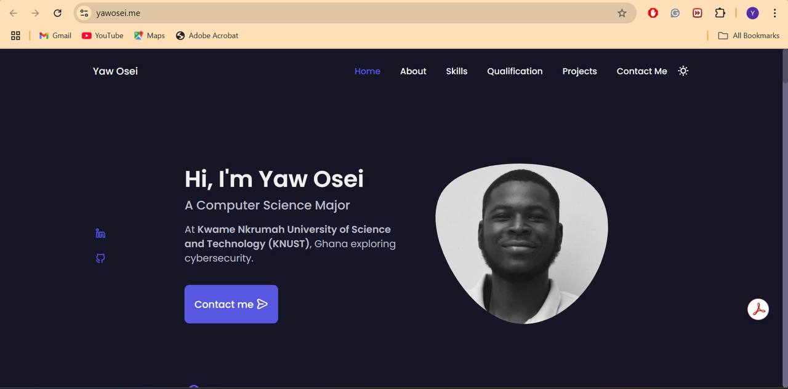

# Personal Portfolio Website

<p align="center">
  
</p>

Personal portfolio showcasing my cybersecurity skills and projects. Built with HTML, CSS, and JavaScript.

## Features

- **Home** — Quick intro and overview
- **About** — Background, education, and goals  
- **Projects** — Selected works with links
- **Skills** — Technologies and tools
- **Contact** — Email and social links

## Technologies

- HTML – Site structure
- CSS – Styling and responsive design
- JavaScript – Interactivity

## Getting Started

```bash
git clone https://github.com/yoadjei/yoadjei.github.io.git
cd yoadjei.github.io
```

Open `index.html` in your browser.

## Contact

📧 **adjeiyawosei@gmail.com**
